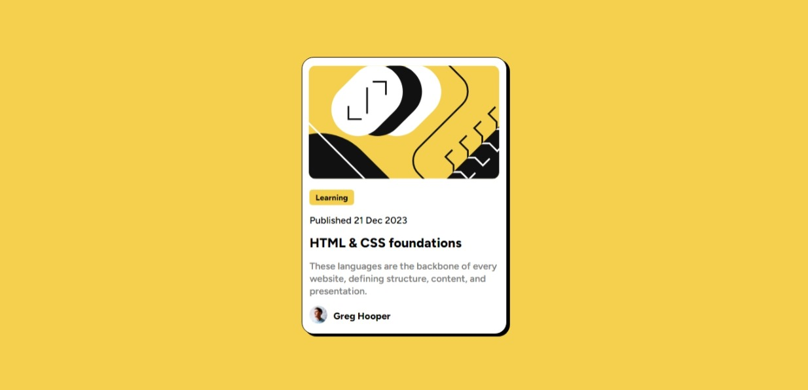

# Frontend Mentor - Blog preview card solution

This is a solution to the [Blog preview card challenge on Frontend Mentor](https://www.frontendmentor.io/challenges/blog-preview-card-ckPaj01IcS). Frontend Mentor challenges help you improve your coding skills by building realistic projects. 

## Table of contents

- [Overview](#overview)
  - [The challenge](#the-challenge)
  - [Screenshot](#screenshot)
  - [Links](#links)
- [My process](#my-process)
  - [Built with](#built-with)
  - [What I learned](#what-i-learned)
- [Author](#author)

**Note: Delete this note and update the table of contents based on what sections you keep.**

## Overview
- Welcome! 👋

Thank you for checking out the solution of this front-end coding challenge.
[Frontend Mentor](https://www.frontendmentor.io) challenge help you improve your coding skills by building realistic projects.

### The challenge

Users are able to:

- See hover and focus states effects for all interactive elements on the page

### Screenshot

### Links

- Solution URL: [solution URL here](https://github.com/DR-KSP-VIRUS/blog-preview-card-main.git)
- Live Site URL: [live site URL here](https://blog-preview-card-main-woad.vercel.app/)

## My process
I used the developer tools in the chrome to monitor the alignment and position of elements in their containers.
I used `CSS3` flexbox to postion the content to the right positions.

### Built with
- Semantic HTML5 markup
- CSS custom properties
- Flexbox
- Mobile-first workflow

### What I learned
I realised there was `fonts` in the folder. This pushed me to learn how to include `web fonts` in local development.

I also got a great suggestion from [Daniel Moraes Mariz](@danielmrz-dev) on [Frontend Mentor](https://www.frontendmentor.io/) on how to write semantic HMTL for SEO purposes

## Author

- Website - [SAMPSON KUMA KONJA](https://blog-preview-card-main-woad.vercel.app/)
- Frontend Mentor - [@yourusername](https://www.frontendmentor.io/profile/yourusername)
